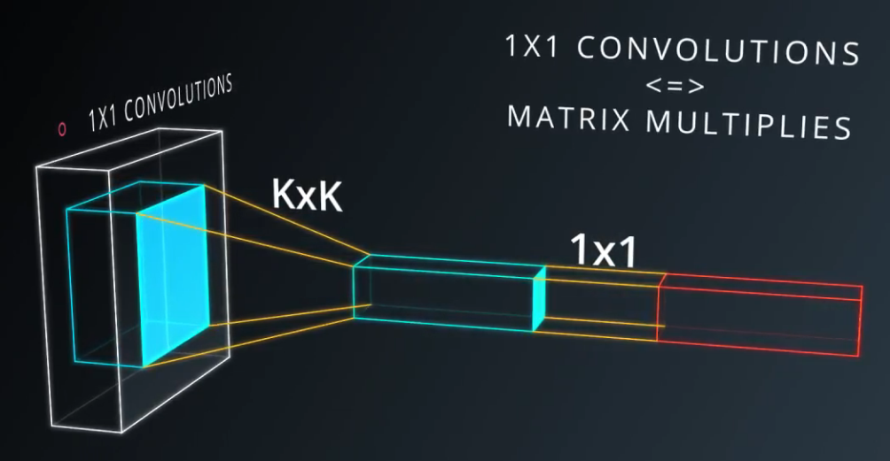
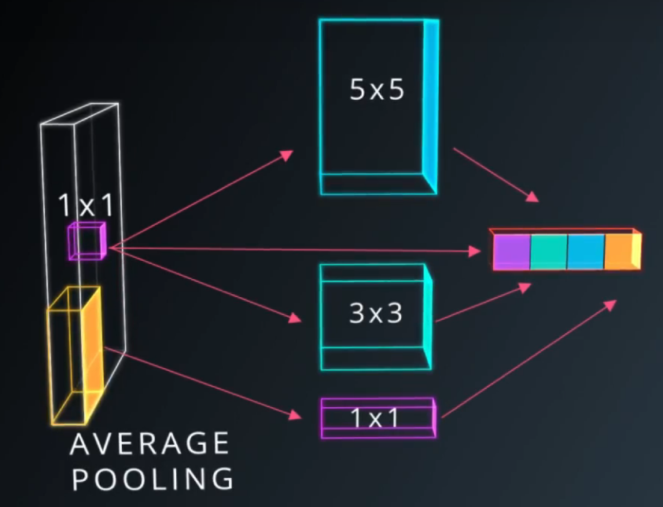

# DL-05-Intro-to-CNN
Udacity Self-Driving Car Engineer: Convolutional Neural Networks (CNN)

## CNN


source(https://adeshpande3.github.io/assets/Cover.png)

Given:
- input layer has a width of ``W`` and a height of ``H``
- convolutional layer has a filter size ``F``
- a stride of ``S``
- a padding of ``P``
- the number of filters ``K``

The following formula gives us the width of the next layer: ``W_out =[(W−F+2P)/S] + 1``.

The output height would be ``H_out = [(H-F+2P)/S] + 1``.

And the output depth would be equal to the number of filters ``D_out = K``.

The output volume would be ``W_out * H_out * D_out``.
## Convolution

source(http://deeplearning.stanford.edu/wiki/index.php/Feature_extraction_using_convolution)

## Implement a CNN in TensorFlow

TensorFlow provides the ``tf.nn.conv2d()`` and ``tf.nn.bias_add()`` functions to create your own convolutional layers.

```python
# Output depth
k_output = 64

# Image Properties
image_width = 10
image_height = 10
color_channels = 3

# Convolution filter
filter_size_width = 5
filter_size_height = 5

# Input/Image
input = tf.placeholder(
    tf.float32,
    shape=[None, image_height, image_width, color_channels])

# Weight and bias
weight = tf.Variable(tf.truncated_normal(
    [filter_size_height, filter_size_width, color_channels, k_output]))
bias = tf.Variable(tf.zeros(k_output))

# Apply Convolution
conv_layer = tf.nn.conv2d(input, weight, strides=[1, 2, 2, 1], padding='SAME')
# Add bias
conv_layer = tf.nn.bias_add(conv_layer, bias)
# Apply activation function
conv_layer = tf.nn.relu(conv_layer)
```
The code above uses the ``tf.nn.conv2d()`` function to compute the convolution with ``weight`` as the filter and ``[1, 2, 2, 1]`` for the strides.

In TensorFlow, strides is an array of 4 elements:
1. stride for batch
2. stride for height
3. stride for width
4. stride for features

PS: You can always set the first and last element to 1 in strides in order to use all batches and features.

The ``tf.nn.bias_add()`` function adds a 1-d bias to the last dimension in a matrix.

To make life easier, the code is using tf.nn.bias_add() to add the bias. Using tf.add() doesn't work when the tensors aren't the same shape.
## Pooling

Recently, pooling layers have fallen out of favor. Some reasons are:

- Recent datasets are so big and complex we're more concerned about underfitting.
- Dropout is a much better regularizer.
- Pooling results in a loss of information. Think about the max pooling operation as an example. We only keep the largest of n numbers, thereby disregarding n-1 numbers completely.


### Max pooling

Max pooling operation is to reduce the size of the input, and allow the neural network to focus on only the most important elements.

- parameter-free --- Does not add to your number of parameters
- prevent overfitting
- often more accurate
- more expensive --- at lower stride
- more hyper parameters --- eg. pooling region size & pooling stride

TensorFlow provides the ``tf.nn.max_pool()`` function to apply max pooling to your convolutional layers.

```python
conv_layer = tf.nn.conv2d(input, weight, strides=[1, 2, 2, 1], padding='SAME')
conv_layer = tf.nn.bias_add(conv_layer, bias)
conv_layer = tf.nn.relu(conv_layer)
# Apply Max Pooling
conv_layer = tf.nn.max_pool(
    conv_layer,
    ksize=[1, 2, 2, 1],
    strides=[1, 2, 2, 1],
    padding='SAME')
```
```python
def maxpool2d(x, k=2):
    return tf.nn.max_pool(
        x,
        ksize=[1, k, k, 1],
        strides=[1, k, k, 1],
        padding='SAME')
```

The tf.nn.max_pool() function performs max pooling with the ksize parameter as the size of the filter and the strides parameter as the length of the stride. 

**2x2 filters with a stride of 2x2 are common in practice.**

The ksize and strides parameters are structured as 4-element lists, with each element corresponding to a dimension of the input tensor ([batch, height, width, channels]).

For both ksize and strides, the batch and channel dimensions are typically set to 1.

**NOTE**: For a pooling layer the output depth is the same as the input depth. Additionally, the pooling operation is applied individually for each depth slice.


## 1 * 1 convolutins



## Inception



## Model

```python
def conv_net(x, weights, biases, dropout):
    # Layer 1 - 28*28*1 to 14*14*32
    conv1 = conv2d(x, weights['wc1'], biases['bc1'])
    conv1 = maxpool2d(conv1, k=2)

    # Layer 2 - 14*14*32 to 7*7*64
    conv2 = conv2d(conv1, weights['wc2'], biases['bc2'])
    conv2 = maxpool2d(conv2, k=2)

    # Fully connected layer - 7*7*64 to 1024
    fc1 = tf.reshape(conv2, [-1, weights['wd1'].get_shape().as_list()[0]])
    fc1 = tf.add(tf.matmul(fc1, weights['wd1']), biases['bd1'])
    fc1 = tf.nn.relu(fc1)
    fc1 = tf.nn.dropout(fc1, dropout)

    # Output Layer - class prediction - 1024 to 10
    out = tf.add(tf.matmul(fc1, weights['out']), biases['out'])
    return out
```

